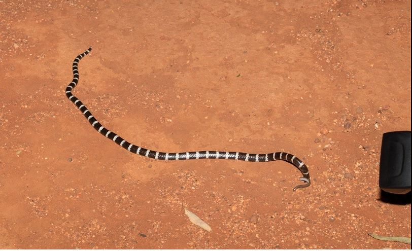

### A long weekend trip
Last weekend was a long weekend in the ACT and I had a chance to visit a lovely spot around Nombinnie Nature Reserve with some mates. The mallee habitat is one of a kind and bush walking in the red (orange) soil was a good remedy for office syndrome. Having recently bought a telephoto lens, I put it to good use spotting many wonderful birds mammals and reptiles. 

The spring flowers are also in full bloom providing a stunning background for photographing kangaroos. 

### Blind snake story
On one of the nights there, after spoting a *Nephurus laevis* we came across a small *Anilios nigrescens*, the first blind snake I ever see alive! 

 

#### Blind snake behaviour note for my future self:
1. Found the snake at around 21:20 on a warm night **without** rain. The snake was slithering on the ground.
1. The tail spur is used very useful for locomotion. While watching the snake move around, I notice whenever it goes in the hole the it uses its tail to either push the body further into the hole or as an anchor to pull itself out from the hole. 
1. When handle, it did not try to poke the handler with the tail spur. Rather, it coiled up around the hand and fingers of the handler. Possibly the same response to avoid predator by coiling around bushes in the habitat. 
1. The snake did not excrete any foul smelling thing when handled gently. 
1. When released, the snake did not seem too bother and did not try to flee.  
1. Unlike what I expected, the snake did not flail around too badly when handle. 

### Blind snake predated
Just moments later, we were treated with a fascinating scene. A bandy bandy (*Vermecelli annulata*) eating another (smaller) blind snake! The bandy bandy was swallowing the little blind snake head first. It only took around 10 minutes to swallow the prey.  

 

### Goannas
Monitor lizards are very common in Bangkok. However, I have not seen a live goanna (the Australian common name for monitor lizards) until this past weekend. We were braced with *Varanus gouldii* (picture below) and *V. varius*.

 

### PhD progress
I've extracted a bunch of blind snake DNA from museum specimens and checking concentrations preparing them for sequencing. I'm also gathering a list of CT scan skulls of *Anilios*. 