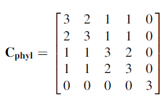

Last week I was trying to analyse shape data with *geomorph* package in R. However, I'm unfamiliar with the terms used in geometric morphometrics literature so I decided to intentionally read "Geometric Morphometric for Biologists - A Primer" by Zelditch, Swiderski and Sheets (2nd edition 2012).

### Here are a few terms I want to note for my future self:

**Disparity** - the variety of a group of species. Outcome of evolutionary processes. The increase in # of taxa does not always mean increase in mophological 'disparity.'

**Variation** - Variety of individuals within a population (homogenous). This is what selection acts on.

**Integration** - tendency for different traits to vary in a coordinated manner throughout (morphology or even the whole organism).

**Modularity** - integrated 'modules' that are compartamentalised. E.g. flowers and compound leaevs are modules but themselves are modular stuructures consistenting  multiple parts arranged in specific ways. Example of modular design is a personal computer where users can swap different hardwares and it will still work if they are compatible. 

### Other notes:

Definition of Shape (Kendall 1997)
**Shape** - is all the geometrical information that remain when location, scale and rotational effects are filtered out from an object.

Configuration matrix defines a shape on a Cartesian coordinate. 

**Pleiotropy** (pleion = 'more' tropos = 'way') - occurs when one gene influence multiple (seemingly) unrelated phenotypes. This is related to integration. 

**Variance-covariance matrix** - "represents the expected covariance structure of the residuals from regression equation" (Garamszegi 2014). Essentially, this matrix is used to account for phylogenetic relationships when applying  generalised least squares. I think I will have to make another post about this when I learn more about it.

 

*The variance-covariance matrix represented by (Garamszegi 2014).*

###  References:
Klingenberg. 2014. Studying morphological integration and modularity at multiple levels: concepts and analysis. Phil. Trans. R. Soc. B 369: 201302493. pp 276-285.

Garamszegi LZ (ed). 2014. Modern Phylogenetic Comparative Methods and Their Application in Evolutionary Biology: Concepts and Practice. Springer Berlin Heidelberg, Berlin, Heidelberg. pp 113-115

Zelditch ML, Swiderski DL, Sheets HD (2012) Geometric morphometrics for biologists: a primer. academic press

สวัสดี