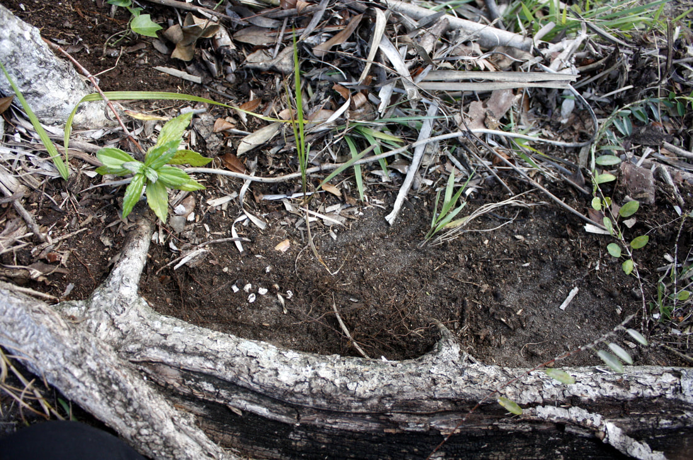
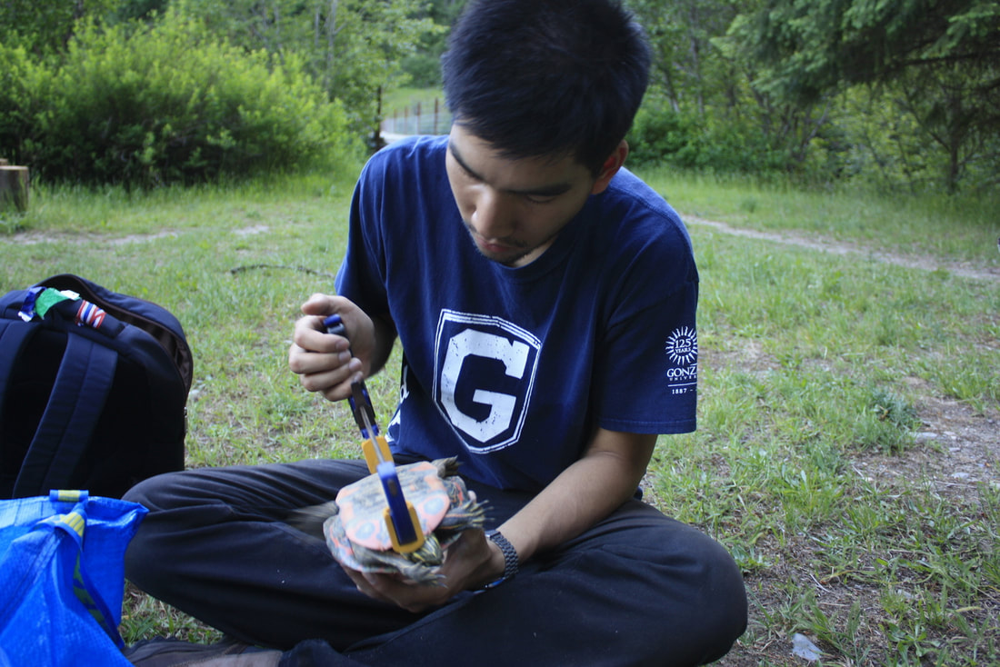

## 2019 - Present
**Keogh Lab - Macroevolution of blind snakes in Australia**

**Australian National University | Canberra, Australia**

My PhD research consist of two parts.
First I will infer a phylogeny for the Australian blind snakes genus Anilios. This first part will involve extracting DNA from tissues deposited in museums across Australia, sequencing the DNA, and figuring out how species are related to each other.

The second part of the project is trying to understand the patterns of diversity we observe today and the morphological differences among different taxa.

This project is supported in part by the Australian Research Council Discovery Grant awarded to Scott Keogh.If you are interested in learning more or collaborating with this project, please contact me.

## 2017-2018

**Warner Lab - anoles**

**Auburn University | Auburn, AL, USA**

My masters thesis research sought to find out if nesting behaviour by mother lizards can shield her eggs from non-ideal conditions. The fieldwork for this project was really fun because I got to walk around suburban Miami and look for anole eggs. We got some odd looks from passerby every now and again but every time was a great opportunity to tell a story about mother lizards and her eggs!

This project challenged me to organize a 2.5 month field work in Miami, not give in to mosquitoes, and to consider different ways to analyse data. I learned a lot about where anoles lay their eggs.

Other than my thesis, I also assist in other on-going projects in the Warner Lab and act as a resident IT trouble shooter for my lab mates.

Co-authors: Nathaniel Pavlik, Josh Hall, and Dan Warner

## 2015

**Warner Lab - turtles and anoles**

**University of Alabama-Birmingham | Birmingham, AL, USA**

I was funded by the Gonzaga Off-Campus Research Experience grant to work with Dr. Dan Warner (who was at the University of Alabama-Birmingham at the time). For the first part of the summer, I collected nesting data on Western painted turtles (Chrysemys picta) in Round Lake State Park nearby Sandpoint, Idaho, as part of a long-term study on the geographic variation of temperature-dependent sex determination. For a month we camped in this lovely state park and went "turtling." It was a fabulous time with camp foods every night.

The second part of the summer was at UAB. There, I conducted an experiment to test the effect of incubation conditions on survival and hatchling phenotypes of anole populations from urban and forested sites. This was the first time I learned to handle lizards and was responsible for caring for them. Prior to this experience, I was adverse to lizards, thanks to Tim Mitchell for showing me the ropes. After the summer, I analysed data and prepared manuscript that led to my first publication (Tiatragul et al. 2017). 

## 2014-2016
**Swanson Lab - fiddler crabs**

**Undergraduate Research Assistant**

**Gonzaga University, Department of Biology | Spokane, WA, USA**

My first research experience introduced me to the beautiful and combative world of fiddler crabs. Males use their major claws to fight each other and attract females. This project took me back to my native Thailand where I collected male fiddler crabs (Uca spp.) claws from the field and brought them back to analyse their morphology digitally using imageJ.

This was also my first time working with a decent size data set (n=200+) and learning R. By my senior year, I analysed some data and spent too much time trying to get this mediocre graph shown on the right!
I like to think I have come a long way with R since.